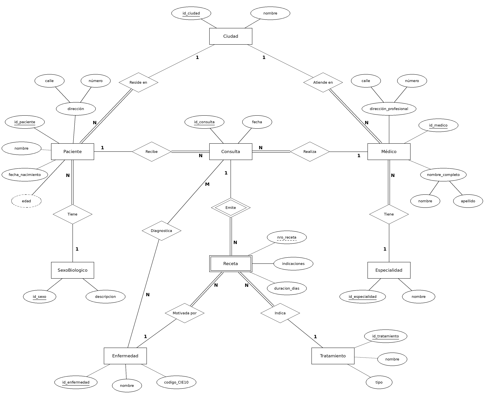
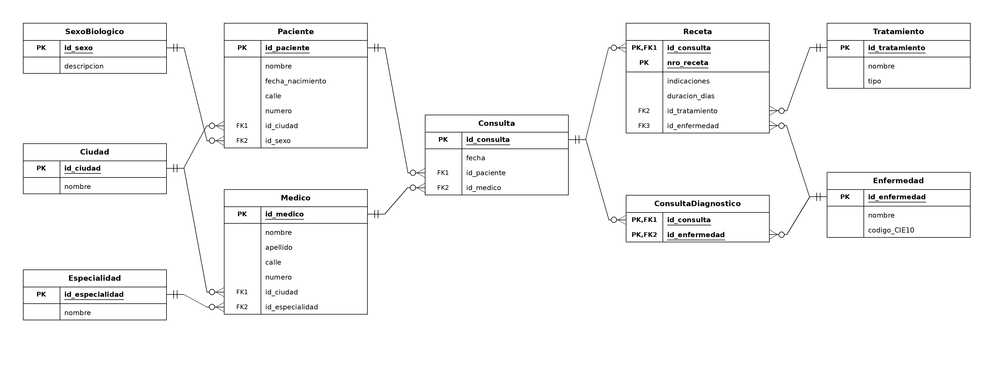

# Trabajo Práctico N°4 — BBDD, SQL y Manejo de Versiones

**Materia:** 16.22 Informática Médica — ITBA

## _Autores:_
* Apellido1 Nombre1
* Apellido2 Nombre2

---

## **PARTE 1:** Bases de Datos

### 1. ¿Qué tipo de base de datos es? Clasificarla según su propósito.

La base de datos del centro médico es una **base de datos relacional transaccional (OLTP – Online Transaction Processing)**.

Según su propósito, las bases de datos relacionales se clasifican en transaccionales (OLTP), orientadas a operar el sistema, y Data Warehouses (OLAP), orientados al análisis de datos. En este caso, el objetivo del sistema es reemplazar los registros en papel y dar soporte a la operación diaria del centro de salud: cada vez que un paciente acude se registra su ficha, y cada consulta puede generar una receta. Esto implica:

- **Operaciones frecuentes y pequeñas** de escritura y modificación (INSERT de pacientes, consultas y recetas; UPDATE de datos como la dirección de un paciente).
- **Datos actuales**, necesarios para el seguimiento del paciente.
- **Necesidad de alta consistencia (propiedades ACID)**: una receta no puede quedar registrada a medias ni asociada a un paciente o médico inexistente.
- **Estructura normalizada**, para evitar redundancia e inconsistencias.
- **Una única fuente de datos** (el propio centro), sin integración de múltiples orígenes.

Si bien el enunciado menciona la obtención de estadísticas demográficas y epidemiológicas, se trata de consultas de agregación que pueden resolverse sobre la misma base operativa y no la convierten en un Data Warehouse. Si en el futuro se requiriera un análisis histórico a gran escala o la integración con otros sistemas, los datos podrían extraerse de esta base hacia un Data Warehouse mediante un proceso ETL/ELT, manteniéndose esta como la base transaccional de origen.

Además, los datos que almacena son principalmente **datos estructurados** (fechas, nombres, códigos, categorías como sexo o especialidad), organizados en un formato predefinido, lo que los hace adecuados para un modelo relacional.

### 2. Modelo conceptual: Diagrama Entidad-Relación (notación de Chen)

#### Entidades y atributos

| Entidad | Tipo | Atributos |
|---|---|---|
| Paciente | Fuerte | <u>id_paciente</u>, nombre, fecha_nacimiento, edad (derivado), dirección (compuesto: calle, número) |
| Médico | Fuerte | <u>id_medico</u>, nombre_completo (compuesto: nombre, apellido), dirección_profesional (compuesto: calle, número) |
| Consulta | Fuerte | <u>id_consulta</u>, fecha |
| Receta | Débil (depende de Consulta) | nro_receta (clave parcial), indicaciones, duracion_dias |
| Tratamiento | Fuerte (referencia) | <u>id_tratamiento</u>, nombre, tipo |
| Enfermedad | Fuerte (referencia) | <u>id_enfermedad</u>, nombre, codigo_CIE10 |
| Especialidad | Fuerte (referencia) | <u>id_especialidad</u>, nombre |
| SexoBiologico | Fuerte (referencia) | <u>id_sexo</u>, descripcion |
| Ciudad | Fuerte (referencia) | <u>id_ciudad</u>, nombre |

#### Relaciones

| Relación | Cardinalidad | Participación | Justificación |
|---|---|---|---|
| Paciente *tiene* SexoBiologico | N:1 | Paciente total / SexoBiologico parcial | El sexo biológico es un dato obligatorio de la ficha; puede existir un valor del catálogo sin pacientes asociados. |
| Paciente *reside en* Ciudad | N:1 | Paciente total / Ciudad parcial | La dirección forma parte de la ficha; puede haber ciudades sin pacientes. |
| Médico *atiende en* Ciudad | N:1 | Médico total / Ciudad parcial | La dirección profesional forma parte de la ficha del médico. |
| Médico *tiene* Especialidad | N:1 | Médico total / Especialidad parcial | La ficha registra "especialidad" (en singular); puede existir una especialidad sin médicos. |
| Paciente *recibe* Consulta | 1:N | Consulta total / Paciente parcial | Toda consulta corresponde a un paciente; un paciente puede tener ficha sin haber sido atendido aún. |
| Médico *realiza* Consulta | 1:N | Consulta total / Médico parcial | Toda consulta la realiza un médico; un médico recién incorporado puede no tener consultas. |
| Consulta *diagnostica* Enfermedad | M:N | Ambas parciales | Una consulta puede registrar varios diagnósticos o ninguno (control); una enfermedad aparece en muchas consultas. |
| Consulta *emite* Receta | 1:N | Receta total / Consulta parcial | Relación identificadora. El médico "puede emitir" una receta: hay consultas sin receta, pero toda receta proviene de una consulta. |
| Receta *indica* Tratamiento | N:1 | Receta total / Tratamiento parcial | Cada receta incluye "el medicamento o tratamiento indicado"; hay tratamientos del catálogo nunca recetados. |
| Receta *motivada por* Enfermedad | N:1 | Receta total / Enfermedad parcial | Cada receta registra la enfermedad o condición que motivó la prescripción. |

#### Decisiones de diseño

- **Tablas de referencia (Especialidad, SexoBiologico, Ciudad, Enfermedad, Tratamiento):** cada valor se almacena una única vez y es referenciado desde las demás entidades. Esto evita redundancia e inconsistencias de escritura (por ejemplo "Cardiología" / "cardiologia"), que harían imposibles las estadísticas por especialidad, sexo, ciudad o enfermedad que requiere el sistema.
- **Consulta como entidad (y no como relación entre Paciente y Médico):** posee atributos propios y de ella dependen otras entidades (recetas y diagnósticos). En el modelo E-R una relación no puede vincularse con otra entidad, por lo que debe modelarse como entidad. Además, facilita su integración con otros módulos (historia clínica, turnos).
- **Consulta como entidad fuerte con identificador propio:** no se modeló como entidad débil de Paciente y Médico porque la fecha no garantiza unicidad (un paciente puede ser atendido dos veces el mismo día por el mismo médico) y porque, al depender Receta de ella, la clave de Receta resultaría excesivamente compuesta.
- **Receta como entidad débil de Consulta:** una receta no existe sin la consulta que la originó (dependencia existencial). Su número (nro_receta) la identifica solo dentro de su consulta, por lo que es una clave parcial. El paciente y el médico de la receta se obtienen a través de la consulta, evitando almacenarlos de forma redundante y posibles inconsistencias.
- **Claves artificiales (id):** el enunciado no provee ningún atributo que identifique unívocamente a pacientes o médicos (los nombres pueden repetirse), por lo que se define un identificador propio que garantiza unicidad y no nulidad.
- **Especificación temporal en Receta y no en Tratamiento:** la duración ("tomar por 5 días", "uso indefinido") es propia de cada indicación y no del medicamento; un mismo medicamento puede indicarse con distintas duraciones. En caso de uso indefinido, duracion_dias toma el valor NULL ("no aplicable").
- **Edad como atributo derivado:** se calcula a partir de la fecha de nacimiento, por lo que no se almacena.
- **Una especialidad por médico y un tratamiento por receta:** se respeta el singular del enunciado. Si un médico indica varios tratamientos en una consulta, se emiten varias recetas (distinto nro_receta). Ambas decisiones podrían extenderse a relaciones M:N si los requerimientos cambiaran.
- **Enfermedad vinculada a Consulta y a Receta:** *diagnostica* registra todos los diagnósticos de la consulta (aunque no generen receta), necesario para el seguimiento epidemiológico; *motivada por* registra el motivo de cada prescripción, necesario para auditorías clínicas. La restricción de que la enfermedad que motiva una receta pertenezca a los diagnósticos de su consulta no puede expresarse en el diagrama E-R y deberá controlarse mediante reglas de negocio.
- **Código CIE-10 en Enfermedad:** se incorpora un código estandarizado internacional para facilitar el análisis epidemiológico y la interoperabilidad con otros sistemas de salud.

### 3. Modelo relacional (notación Crow's Foot)

#### Proceso de mapeo

**1° Mapeo de entidades fuertes.** Cada entidad fuerte se transforma en una tabla con sus atributos univaluados. Los atributos compuestos se reemplazan por sus componentes atómicos (`dirección` → `calle`, `numero`; `nombre_completo` → `nombre`, `apellido`) y el atributo derivado `edad` no se mapea, ya que se calcula a partir de `fecha_nacimiento`.

**2° Mapeo de la entidad débil.** Receta incorpora como clave foránea la clave primaria de su entidad dominante (Consulta). Su clave primaria es compuesta: `id_consulta` + `nro_receta` (clave parcial). La clave foránea `id_consulta` no puede ser NULL.

**3° Mapeo de relaciones 1:N.** En todas las relaciones 1:N se agrega en la tabla del lado N una clave foránea que referencia la clave primaria del lado 1. Como en todos los casos la entidad del lado N tiene participación total, todas estas claves foráneas son **NOT NULL**:
- Paciente: `id_ciudad`, `id_sexo`
- Medico: `id_ciudad`, `id_especialidad`
- Consulta: `id_paciente`, `id_medico`
- Receta: `id_tratamiento`, `id_enfermedad`

**4° Mapeo de relaciones M:N.** La relación *Diagnostica* (Consulta–Enfermedad) no puede embeberse en ninguna de las dos tablas, por lo que se crea la tabla intermedia ConsultaDiagnostico, cuya clave primaria es la combinación de ambas claves foráneas (`id_consulta`, `id_enfermedad`), que no pueden ser NULL.

#### Esquema relacional

- **SexoBiologico**(<u>id_sexo</u>, descripcion)
- **Ciudad**(<u>id_ciudad</u>, nombre)
- **Especialidad**(<u>id_especialidad</u>, nombre)
- **Tratamiento**(<u>id_tratamiento</u>, nombre, tipo)
- **Enfermedad**(<u>id_enfermedad</u>, nombre, codigo_CIE10)
- **Paciente**(<u>id_paciente</u>, nombre, fecha_nacimiento, calle, numero, id_ciudad (FK), id_sexo (FK))
- **Medico**(<u>id_medico</u>, nombre, apellido, calle, numero, id_ciudad (FK), id_especialidad (FK))
- **Consulta**(<u>id_consulta</u>, fecha, id_paciente (FK), id_medico (FK))
- **Receta**(<u>id_consulta (FK), nro_receta</u>, indicaciones, duracion_dias, id_tratamiento (FK), id_enfermedad (FK))
- **ConsultaDiagnostico**(<u>id_consulta (FK), id_enfermedad (FK)</u>)

#### Cardinalidades del diagrama

| Relación | Lado 1 | Lado N | Lectura |
|---|---|---|---|
| SexoBiologico – Paciente | uno y solo uno | cero o muchos | Cada paciente tiene exactamente un sexo biológico; un valor puede no estar asignado a ningún paciente. |
| Ciudad – Paciente | uno y solo uno | cero o muchos | Cada paciente reside en exactamente una ciudad; una ciudad puede no tener pacientes. |
| Ciudad – Medico | uno y solo uno | cero o muchos | Cada médico tiene su dirección profesional en exactamente una ciudad. |
| Especialidad – Medico | uno y solo uno | cero o muchos | Cada médico tiene exactamente una especialidad; una especialidad puede no tener médicos. |
| Paciente – Consulta | uno y solo uno | cero o muchos | Cada consulta es de un único paciente; un paciente puede no tener consultas. |
| Medico – Consulta | uno y solo uno | cero o muchos | Cada consulta la realiza un único médico; un médico puede no tener consultas. |
| Consulta – Receta | uno y solo uno | cero o muchos | Cada receta pertenece a una única consulta; una consulta puede no emitir recetas. |
| Tratamiento – Receta | uno y solo uno | cero o muchos | Cada receta indica un único tratamiento; un tratamiento puede no haber sido recetado. |
| Enfermedad – Receta | uno y solo uno | cero o muchos | Cada receta es motivada por una única enfermedad. |
| Consulta – ConsultaDiagnostico | uno y solo uno | cero o muchos | Una consulta puede no tener diagnósticos o tener varios. |
| Enfermedad – ConsultaDiagnostico | uno y solo uno | cero o muchos | Una enfermedad puede no haber sido diagnosticada o figurar en varias consultas. |

En todos los casos, el lado "uno y solo uno" se corresponde con una clave foránea NOT NULL en la tabla del lado N. En ConsultaDiagnostico la participación opcional ("cero o muchos") se refleja en la ausencia de filas, no en claves foráneas nulas.

**Restricción no representable en el modelo:** la enfermedad que motiva una receta (`Receta.id_enfermedad`) debería estar registrada entre los diagnósticos de su consulta (ConsultaDiagnostico). Esta regla de negocio no puede expresarse mediante claves foráneas simples y deberá garantizarse mediante restricciones adicionales en el DBMS o lógica de aplicación.

### 4. Indicar qué forma normal se viola en los siguientes casos y justificar

Para cada caso se verifican las formas normales en orden (1FN → 2FN → 3FN → BCNF → 4FN), ya que cada una requiere el cumplimiento de las anteriores. Se identifica la primera que no se cumple, se justifica y se propone la descomposición que lo resuelve.

#### Caso 1 — Viola la **Primera Forma Normal (1FN)**

| PacienteID (PK) | Nombre | Teléfonos |
|---|---|---|
| 1 | Ana | 1111, 2222 |
| 2 | Juan | 3333 |

**Justificación:** la 1FN exige que cada celda contenga un único valor atómico. La columna `Teléfonos` almacena una lista de valores en una misma celda ("1111, 2222"). `Teléfonos` es un atributo multivaluado.

**Problemas que genera:** no es posible buscar a un paciente por un teléfono puntual sin procesar el texto, ni modificar o eliminar un único teléfono sin reescribir toda la celda.

**Solución:** repetir la fila por cada teléfono resolvería la 1FN, pero generaría una dependencia parcial (la clave pasaría a ser `PacienteID + Teléfono` y `Nombre` dependería solo de `PacienteID`), violando la 2FN. Por eso se separa el atributo multivaluado en una tabla propia, tal como indica el mapeo de atributos multivaluados:

**Paciente**

| PacienteID (PK) | Nombre |
|---|---|
| 1 | Ana |
| 2 | Juan |

**PacienteTelefono**

| PacienteID (PK, FK) | Telefono (PK) |
|---|---|
| 1 | 1111 |
| 1 | 2222 |
| 2 | 3333 |

#### Caso 2 — Viola la **Tercera Forma Normal (3FN)**

| PacienteID (PK) | Ciudad | CódigoPostal |
|---|---|---|
| 1 | CABA | 1000 |
| 2 | La Plata | 1900 |

**Justificación:**
- **1FN:** se cumple. Todos los valores son atómicos y existe clave primaria.
- **2FN:** se cumple. La clave primaria es simple (`PacienteID`), por lo que no pueden existir dependencias parciales.
- **3FN:** no se cumple. Existe una **dependencia transitiva**: `PacienteID → Ciudad → CódigoPostal`. El código postal no depende directamente del paciente, sino de la ciudad, que es un atributo no clave. Un atributo no clave determina a otro atributo no clave.

**Problemas que genera:**
- *Redundancia:* el código postal de una ciudad se repite en cada paciente que vive en ella.
- *Anomalía de actualización:* si cambia el código postal de una ciudad, hay que modificar todas las filas de sus pacientes; si se omite alguna, quedan datos inconsistentes.
- *Anomalía de inserción:* no es posible registrar el código postal de una ciudad sin un paciente que viva allí.
- *Anomalía de eliminación:* al eliminar al único paciente de La Plata se pierde el código postal de esa ciudad.

**Solución:** se separa la dependencia transitiva en una tabla propia, referenciada mediante clave foránea:

**Paciente**

| PacienteID (PK) | CiudadID (FK) |
|---|---|
| 1 | 1 |
| 2 | 2 |

**Ciudad**

| CiudadID (PK) | Nombre | CódigoPostal |
|---|---|---|
| 1 | CABA | 1000 |
| 2 | La Plata | 1900 |

*Observación:* en la realidad, una ciudad puede tener varios códigos postales, por lo que la dependencia funcional real es `CódigoPostal → Ciudad`. En ese caso la descomposición correcta sería una tabla CodigoPostal(<u>CódigoPostal</u>, Ciudad) referenciada desde Paciente. En ambas interpretaciones se trata de una dependencia transitiva entre atributos no clave y, por lo tanto, de una violación de la 3FN.

#### Caso 3 — Viola la **Segunda Forma Normal (2FN)**

| PacienteID (PK) | MédicoID (PK) | NombrePaciente | Especialidad |
|---|---|---|---|
| 1 | 10 | Ana | Pediatría |
| 2 | 20 | Juan | Cardiología |

**Justificación:**
- **1FN:** se cumple. Valores atómicos y clave primaria compuesta (`PacienteID`, `MédicoID`).
- **2FN:** no se cumple. Existen **dependencias parciales**: los atributos no clave no dependen de la clave completa, sino de una parte de ella.
  - `PacienteID → NombrePaciente` (el nombre depende solo del paciente, no del médico).
  - `MédicoID → Especialidad` (la especialidad depende solo del médico, no del paciente).

**Problemas que genera:** el nombre del paciente se repite en cada atención que recibe y la especialidad del médico en cada atención que realiza. Si un médico cambia de especialidad hay que modificar todas sus filas. Además, no se puede registrar un médico con su especialidad hasta que atienda a un paciente, y al eliminar la última atención de un médico se pierde su especialidad.

**Solución:** cada atributo se lleva a la tabla de la parte de la clave de la que depende, y la relación entre ambos queda en una tabla propia:

**Paciente**

| PacienteID (PK) | NombrePaciente |
|---|---|
| 1 | Ana |
| 2 | Juan |

**Medico**

| MédicoID (PK) | Especialidad |
|---|---|
| 10 | Pediatría |
| 20 | Cardiología |

**Atencion**

| PacienteID (PK, FK) | MédicoID (PK, FK) |
|---|---|
| 1 | 10 |
| 2 | 20 |

Adicionalmente, para evitar inconsistencias en la escritura de las especialidades, `Especialidad` puede reemplazarse por una clave foránea a una tabla de referencia Especialidad, como se propone en el modelo de los puntos 2 y 3.

#### Caso 4 — Viola la **Cuarta Forma Normal (4FN)**

| PacienteID | Enfermedad | Medicamento |
|---|---|---|
| 1 | Gripe | Paracetamol |
| 1 | Gripe | Ibuprofeno |
| 1 | Diabetes | Paracetamol |
| 1 | Diabetes | Ibuprofeno |

**Justificación:**
- **1FN:** se cumple. Los valores son atómicos. No hay un atributo que por sí solo identifique cada fila: la única clave candidata es la combinación de las tres columnas (`PacienteID`, `Enfermedad`, `Medicamento`).
- **2FN, 3FN y BCNF:** se cumplen. Al estar todos los atributos dentro de la clave, no existen atributos no clave que puedan presentar dependencias parciales o transitivas, ni dependencias funcionales no triviales.
- **4FN:** no se cumple. Existen dos **dependencias multivaluadas independientes**:
  - `PacienteID →→ Enfermedad`
  - `PacienteID →→ Medicamento`

  Las enfermedades y los medicamentos del paciente son hechos independientes entre sí, pero al almacenarse en la misma tabla se genera el **producto cartesiano** de ambos conjuntos (2 enfermedades × 2 medicamentos = 4 filas), creando combinaciones artificiales: la tabla parece indicar que el paracetamol fue indicado para la diabetes.

**Problemas que genera:** para agregar un nuevo medicamento al paciente hay que insertar una fila por cada enfermedad que tenga (y viceversa); si se omite alguna, la tabla queda inconsistente. La redundancia crece multiplicativamente.

**Solución:** se separa cada dependencia multivaluada en su propia tabla:

**PacienteEnfermedad**

| PacienteID (PK) | Enfermedad (PK) |
|---|---|
| 1 | Gripe |
| 1 | Diabetes |

**PacienteMedicamento**

| PacienteID (PK) | Medicamento (PK) |
|---|---|
| 1 | Paracetamol |
| 1 | Ibuprofeno |

*Observación:* si clínicamente se quisiera registrar qué medicamento se indicó para cada enfermedad, la relación entre las tres columnas dejaría de ser independiente y se trataría de una relación ternaria válida (sin producto cartesiano). En el modelo propuesto en los puntos 2 y 3 esa información se registra en Receta, que vincula cada tratamiento con la enfermedad que motivó su prescripción.

---

## **PARTE 2:** SQL

_(pendiente)_
