# Trabajo Práctico N°4 — BBDD, SQL y Manejo de Versiones

**Materia:** 16.22 Informática Médica — ITBA

## _Autores:_
* Kerschen Ferrari, Paz
* Kestelboim, Andrés
* Tarda, Tobías

---

## **PARTE 1:** Bases de Datos

### 1. ¿Qué tipo de base de datos es? Clasificarla según su propósito.

La base de datos del centro médico es una **base de datos relacional transaccional (OLTP – Online Transaction Processing)**.

Según su propósito, las bases de datos relacionales se clasifican en transaccionales (OLTP), orientadas a operar el sistema, y Data Warehouses (OLAP), orientados al análisis de datos. En este caso, el objetivo del sistema es reemplazar los registros en papel y dar soporte a la operación diaria del centro de salud: cada vez que un paciente acude se registra su ficha, y cada consulta puede generar una receta. Esto implica:

- **Operaciones frecuentes y pequeñas** de escritura y modificación (INSERT de pacientes, consultas y recetas; UPDATE de datos como la dirección de un paciente).
- **Datos actuales**, necesarios para el seguimiento del paciente.
- **Necesidad de alta consistencia (propiedades ACID)**: una receta no puede quedar registrada a medias ni asociada a un paciente o médico inexistente.
- **Estructura normalizada**, para evitar redundancia e inconsistencias.
- **Una única fuente de datos** (el propio centro), sin integración de múltiples orígenes.

Si bien el enunciado menciona la obtención de estadísticas demográficas y epidemiológicas, se trata de consultas de agregación que pueden resolverse sobre la misma base operativa y no la convierten en un Data Warehouse. Si en el futuro se requiriera un análisis histórico a gran escala o la integración con otros sistemas, los datos podrían extraerse de esta base hacia un Data Warehouse mediante un proceso ETL/ELT, manteniéndose esta como la base transaccional de origen.

Además, los datos que almacena son principalmente **datos estructurados** (fechas, nombres, códigos, categorías como sexo o especialidad), organizados en un formato predefinido, lo que los hace adecuados para un modelo relacional.

### 2. Modelo conceptual: Diagrama Entidad-Relación (notación de Chen)


#### Entidades y atributos

| Entidad | Tipo | Atributos |
|---|---|---|
| Paciente | Fuerte | <u>id_paciente</u>, nombre, fecha_nacimiento, edad (derivado), dirección (compuesto: calle, número) |
| Médico | Fuerte | <u>id_medico</u>, nombre_completo (compuesto: nombre, apellido), dirección_profesional (compuesto: calle, número) |
| Consulta | Fuerte | <u>id_consulta</u>, fecha |
| Receta | Débil (depende de Consulta) | nro_receta (clave parcial), indicaciones, duracion_dias |
| Tratamiento | Fuerte (referencia) | <u>id_tratamiento</u>, nombre, tipo |
| Enfermedad | Fuerte (referencia) | <u>id_enfermedad</u>, nombre, codigo_CIE10 |
| Especialidad | Fuerte (referencia) | <u>id_especialidad</u>, nombre |
| SexoBiologico | Fuerte (referencia) | <u>id_sexo</u>, descripcion |
| Ciudad | Fuerte (referencia) | <u>id_ciudad</u>, nombre |

#### Relaciones

| Relación | Cardinalidad | Participación | Justificación |
|---|---|---|---|
| Paciente *tiene* SexoBiologico | N:1 | Paciente total / SexoBiologico parcial | El sexo biológico es un dato obligatorio de la ficha; puede existir un valor del catálogo sin pacientes asociados. |
| Paciente *reside en* Ciudad | N:1 | Paciente total / Ciudad parcial | La dirección forma parte de la ficha; puede haber ciudades sin pacientes. |
| Médico *atiende en* Ciudad | N:1 | Médico total / Ciudad parcial | La dirección profesional forma parte de la ficha del médico. |
| Médico *tiene* Especialidad | N:1 | Médico total / Especialidad parcial | La ficha registra "especialidad" (en singular); puede existir una especialidad sin médicos. |
| Paciente *recibe* Consulta | 1:N | Consulta total / Paciente parcial | Toda consulta corresponde a un paciente; un paciente puede tener ficha sin haber sido atendido aún. |
| Médico *realiza* Consulta | 1:N | Consulta total / Médico parcial | Toda consulta la realiza un médico; un médico recién incorporado puede no tener consultas. |
| Consulta *diagnostica* Enfermedad | M:N | Ambas parciales | Una consulta puede registrar varios diagnósticos o ninguno (control); una enfermedad aparece en muchas consultas. |
| Consulta *emite* Receta | 1:N | Receta total / Consulta parcial | Relación identificadora. El médico "puede emitir" una receta: hay consultas sin receta, pero toda receta proviene de una consulta. |
| Receta *indica* Tratamiento | N:1 | Receta total / Tratamiento parcial | Cada receta incluye "el medicamento o tratamiento indicado"; hay tratamientos del catálogo nunca recetados. |
| Receta *motivada por* Enfermedad | N:1 | Receta total / Enfermedad parcial | Cada receta registra la enfermedad o condición que motivó la prescripción. |

#### Decisiones de diseño

- **Tablas de referencia (Especialidad, SexoBiologico, Ciudad, Enfermedad, Tratamiento):** cada valor se almacena una única vez y es referenciado desde las demás entidades. Esto evita redundancia e inconsistencias de escritura (por ejemplo "Cardiología" / "cardiologia"), que harían imposibles las estadísticas por especialidad, sexo, ciudad o enfermedad que requiere el sistema.
- **Consulta como entidad (y no como relación entre Paciente y Médico):** posee atributos propios y de ella dependen otras entidades (recetas y diagnósticos). En el modelo E-R una relación no puede vincularse con otra entidad, por lo que debe modelarse como entidad. Además, facilita su integración con otros módulos (historia clínica, turnos).
- **Consulta como entidad fuerte con identificador propio:** no se modeló como entidad débil de Paciente y Médico porque la fecha no garantiza unicidad (un paciente puede ser atendido dos veces el mismo día por el mismo médico) y porque, al depender Receta de ella, la clave de Receta resultaría excesivamente compuesta.
- **Receta como entidad débil de Consulta:** una receta no existe sin la consulta que la originó (dependencia existencial). Su número (nro_receta) la identifica solo dentro de su consulta, por lo que es una clave parcial. El paciente y el médico de la receta se obtienen a través de la consulta, evitando almacenarlos de forma redundante y posibles inconsistencias.
- **Claves artificiales (id):** el enunciado no provee ningún atributo que identifique unívocamente a pacientes o médicos (los nombres pueden repetirse), por lo que se define un identificador propio que garantiza unicidad y no nulidad.
- **Especificación temporal en Receta y no en Tratamiento:** la duración ("tomar por 5 días", "uso indefinido") es propia de cada indicación y no del medicamento; un mismo medicamento puede indicarse con distintas duraciones. En caso de uso indefinido, duracion_dias toma el valor NULL ("no aplicable").
- **Edad como atributo derivado:** se calcula a partir de la fecha de nacimiento, por lo que no se almacena.
- **Una especialidad por médico y un tratamiento por receta:** se respeta el singular del enunciado. Si un médico indica varios tratamientos en una consulta, se emiten varias recetas (distinto nro_receta). Ambas decisiones podrían extenderse a relaciones M:N si los requerimientos cambiaran.
- **Enfermedad vinculada a Consulta y a Receta:** *diagnostica* registra todos los diagnósticos de la consulta (aunque no generen receta), necesario para el seguimiento epidemiológico; *motivada por* registra el motivo de cada prescripción, necesario para auditorías clínicas. La restricción de que la enfermedad que motiva una receta pertenezca a los diagnósticos de su consulta no puede expresarse en el diagrama E-R y deberá controlarse mediante reglas de negocio.
- **Código CIE-10 en Enfermedad:** se incorpora un código estandarizado internacional para facilitar el análisis epidemiológico y la interoperabilidad con otros sistemas de salud.

### 3. Modelo relacional (notación Crow's Foot)


#### Proceso de mapeo

**1° Mapeo de entidades fuertes.** Cada entidad fuerte se transforma en una tabla con sus atributos univaluados. Los atributos compuestos se reemplazan por sus componentes atómicos (`dirección` → `calle`, `numero`; `nombre_completo` → `nombre`, `apellido`) y el atributo derivado `edad` no se mapea, ya que se calcula a partir de `fecha_nacimiento`.

**2° Mapeo de la entidad débil.** Receta incorpora como clave foránea la clave primaria de su entidad dominante (Consulta). Su clave primaria es compuesta: `id_consulta` + `nro_receta` (clave parcial). La clave foránea `id_consulta` no puede ser NULL.

**3° Mapeo de relaciones 1:N.** En todas las relaciones 1:N se agrega en la tabla del lado N una clave foránea que referencia la clave primaria del lado 1. Como en todos los casos la entidad del lado N tiene participación total, todas estas claves foráneas son **NOT NULL**:
- Paciente: `id_ciudad`, `id_sexo`
- Medico: `id_ciudad`, `id_especialidad`
- Consulta: `id_paciente`, `id_medico`
- Receta: `id_tratamiento`, `id_enfermedad`

**4° Mapeo de relaciones M:N.** La relación *Diagnostica* (Consulta–Enfermedad) no puede embeberse en ninguna de las dos tablas, por lo que se crea la tabla intermedia ConsultaDiagnostico, cuya clave primaria es la combinación de ambas claves foráneas (`id_consulta`, `id_enfermedad`), que no pueden ser NULL.

#### Esquema relacional

- **SexoBiologico**(<u>id_sexo</u>, descripcion)
- **Ciudad**(<u>id_ciudad</u>, nombre)
- **Especialidad**(<u>id_especialidad</u>, nombre)
- **Tratamiento**(<u>id_tratamiento</u>, nombre, tipo)
- **Enfermedad**(<u>id_enfermedad</u>, nombre, codigo_CIE10)
- **Paciente**(<u>id_paciente</u>, nombre, fecha_nacimiento, calle, numero, id_ciudad (FK), id_sexo (FK))
- **Medico**(<u>id_medico</u>, nombre, apellido, calle, numero, id_ciudad (FK), id_especialidad (FK))
- **Consulta**(<u>id_consulta</u>, fecha, id_paciente (FK), id_medico (FK))
- **Receta**(<u>id_consulta (FK), nro_receta</u>, indicaciones, duracion_dias, id_tratamiento (FK), id_enfermedad (FK))
- **ConsultaDiagnostico**(<u>id_consulta (FK), id_enfermedad (FK)</u>)

#### Cardinalidades del diagrama

| Relación | Lado 1 | Lado N | Lectura |
|---|---|---|---|
| SexoBiologico – Paciente | uno y solo uno | cero o muchos | Cada paciente tiene exactamente un sexo biológico; un valor puede no estar asignado a ningún paciente. |
| Ciudad – Paciente | uno y solo uno | cero o muchos | Cada paciente reside en exactamente una ciudad; una ciudad puede no tener pacientes. |
| Ciudad – Medico | uno y solo uno | cero o muchos | Cada médico tiene su dirección profesional en exactamente una ciudad. |
| Especialidad – Medico | uno y solo uno | cero o muchos | Cada médico tiene exactamente una especialidad; una especialidad puede no tener médicos. |
| Paciente – Consulta | uno y solo uno | cero o muchos | Cada consulta es de un único paciente; un paciente puede no tener consultas. |
| Medico – Consulta | uno y solo uno | cero o muchos | Cada consulta la realiza un único médico; un médico puede no tener consultas. |
| Consulta – Receta | uno y solo uno | cero o muchos | Cada receta pertenece a una única consulta; una consulta puede no emitir recetas. |
| Tratamiento – Receta | uno y solo uno | cero o muchos | Cada receta indica un único tratamiento; un tratamiento puede no haber sido recetado. |
| Enfermedad – Receta | uno y solo uno | cero o muchos | Cada receta es motivada por una única enfermedad. |
| Consulta – ConsultaDiagnostico | uno y solo uno | cero o muchos | Una consulta puede no tener diagnósticos o tener varios. |
| Enfermedad – ConsultaDiagnostico | uno y solo uno | cero o muchos | Una enfermedad puede no haber sido diagnosticada o figurar en varias consultas. |

En todos los casos, el lado "uno y solo uno" se corresponde con una clave foránea NOT NULL en la tabla del lado N. En ConsultaDiagnostico la participación opcional ("cero o muchos") se refleja en la ausencia de filas, no en claves foráneas nulas.

**Restricción no representable en el modelo:** la enfermedad que motiva una receta (`Receta.id_enfermedad`) debería estar registrada entre los diagnósticos de su consulta (ConsultaDiagnostico). Esta regla de negocio no puede expresarse mediante claves foráneas simples y deberá garantizarse mediante restricciones adicionales en el DBMS o lógica de aplicación.

### 4. Indicar qué forma normal se viola en los siguientes casos y justificar

Para cada caso se verifican las formas normales en orden (1FN → 2FN → 3FN → BCNF → 4FN), ya que cada una requiere el cumplimiento de las anteriores. Se identifica la primera que no se cumple, se justifica y se propone la descomposición que lo resuelve.

#### Caso 1 — Viola la **Primera Forma Normal (1FN)**

| PacienteID (PK) | Nombre | Teléfonos |
|---|---|---|
| 1 | Ana | 1111, 2222 |
| 2 | Juan | 3333 |

**Justificación:** la 1FN exige que cada celda contenga un único valor atómico. La columna `Teléfonos` almacena una lista de valores en una misma celda ("1111, 2222"). `Teléfonos` es un atributo multivaluado.

**Problemas que genera:** no es posible buscar a un paciente por un teléfono puntual sin procesar el texto, ni modificar o eliminar un único teléfono sin reescribir toda la celda.

**Solución:** repetir la fila por cada teléfono resolvería la 1FN, pero generaría una dependencia parcial (la clave pasaría a ser `PacienteID + Teléfono` y `Nombre` dependería solo de `PacienteID`), violando la 2FN. Por eso se separa el atributo multivaluado en una tabla propia, tal como indica el mapeo de atributos multivaluados:

**Paciente**

| PacienteID (PK) | Nombre |
|---|---|
| 1 | Ana |
| 2 | Juan |

**PacienteTelefono**

| PacienteID (PK, FK) | Telefono (PK) |
|---|---|
| 1 | 1111 |
| 1 | 2222 |
| 2 | 3333 |

#### Caso 2 — Viola la **Tercera Forma Normal (3FN)**

| PacienteID (PK) | Ciudad | CódigoPostal |
|---|---|---|
| 1 | CABA | 1000 |
| 2 | La Plata | 1900 |

**Justificación:**
- **1FN:** se cumple. Todos los valores son atómicos y existe clave primaria.
- **2FN:** se cumple. La clave primaria es simple (`PacienteID`), por lo que no pueden existir dependencias parciales.
- **3FN:** no se cumple. Existe una **dependencia transitiva**: `PacienteID → Ciudad → CódigoPostal`. El código postal no depende directamente del paciente, sino de la ciudad, que es un atributo no clave. Un atributo no clave determina a otro atributo no clave.

**Problemas que genera:**
- *Redundancia:* el código postal de una ciudad se repite en cada paciente que vive en ella.
- *Anomalía de actualización:* si cambia el código postal de una ciudad, hay que modificar todas las filas de sus pacientes; si se omite alguna, quedan datos inconsistentes.
- *Anomalía de inserción:* no es posible registrar el código postal de una ciudad sin un paciente que viva allí.
- *Anomalía de eliminación:* al eliminar al único paciente de La Plata se pierde el código postal de esa ciudad.

**Solución:** se separa la dependencia transitiva en una tabla propia, referenciada mediante clave foránea:

**Paciente**

| PacienteID (PK) | CiudadID (FK) |
|---|---|
| 1 | 1 |
| 2 | 2 |

**Ciudad**

| CiudadID (PK) | Nombre | CódigoPostal |
|---|---|---|
| 1 | CABA | 1000 |
| 2 | La Plata | 1900 |

*Observación:* en la realidad, una ciudad puede tener varios códigos postales, por lo que la dependencia funcional real es `CódigoPostal → Ciudad`. En ese caso la descomposición correcta sería una tabla CodigoPostal(<u>CódigoPostal</u>, Ciudad) referenciada desde Paciente. En ambas interpretaciones se trata de una dependencia transitiva entre atributos no clave y, por lo tanto, de una violación de la 3FN.

#### Caso 3 — Viola la **Segunda Forma Normal (2FN)**

| PacienteID (PK) | MédicoID (PK) | NombrePaciente | Especialidad |
|---|---|---|---|
| 1 | 10 | Ana | Pediatría |
| 2 | 20 | Juan | Cardiología |

**Justificación:**
- **1FN:** se cumple. Valores atómicos y clave primaria compuesta (`PacienteID`, `MédicoID`).
- **2FN:** no se cumple. Existen **dependencias parciales**: los atributos no clave no dependen de la clave completa, sino de una parte de ella.
  - `PacienteID → NombrePaciente` (el nombre depende solo del paciente, no del médico).
  - `MédicoID → Especialidad` (la especialidad depende solo del médico, no del paciente).

**Problemas que genera:** el nombre del paciente se repite en cada atención que recibe y la especialidad del médico en cada atención que realiza. Si un médico cambia de especialidad hay que modificar todas sus filas. Además, no se puede registrar un médico con su especialidad hasta que atienda a un paciente, y al eliminar la última atención de un médico se pierde su especialidad.

**Solución:** cada atributo se lleva a la tabla de la parte de la clave de la que depende, y la relación entre ambos queda en una tabla propia:

**Paciente**

| PacienteID (PK) | NombrePaciente |
|---|---|
| 1 | Ana |
| 2 | Juan |

**Medico**

| MédicoID (PK) | Especialidad |
|---|---|
| 10 | Pediatría |
| 20 | Cardiología |

**Atencion**

| PacienteID (PK, FK) | MédicoID (PK, FK) |
|---|---|
| 1 | 10 |
| 2 | 20 |

Adicionalmente, para evitar inconsistencias en la escritura de las especialidades, `Especialidad` puede reemplazarse por una clave foránea a una tabla de referencia Especialidad, como se propone en el modelo de los puntos 2 y 3.

#### Caso 4 — Viola la **Cuarta Forma Normal (4FN)**

| PacienteID | Enfermedad | Medicamento |
|---|---|---|
| 1 | Gripe | Paracetamol |
| 1 | Gripe | Ibuprofeno |
| 1 | Diabetes | Paracetamol |
| 1 | Diabetes | Ibuprofeno |

**Justificación:**
- **1FN:** se cumple. Los valores son atómicos. No hay un atributo que por sí solo identifique cada fila: la única clave candidata es la combinación de las tres columnas (`PacienteID`, `Enfermedad`, `Medicamento`).
- **2FN, 3FN y BCNF:** se cumplen. Al estar todos los atributos dentro de la clave, no existen atributos no clave que puedan presentar dependencias parciales o transitivas, ni dependencias funcionales no triviales.
- **4FN:** no se cumple. Existen dos **dependencias multivaluadas independientes**:
  - `PacienteID →→ Enfermedad`
  - `PacienteID →→ Medicamento`

  Las enfermedades y los medicamentos del paciente son hechos independientes entre sí, pero al almacenarse en la misma tabla se genera el **producto cartesiano** de ambos conjuntos (2 enfermedades × 2 medicamentos = 4 filas), creando combinaciones artificiales: la tabla parece indicar que el paracetamol fue indicado para la diabetes.

**Problemas que genera:** para agregar un nuevo medicamento al paciente hay que insertar una fila por cada enfermedad que tenga (y viceversa); si se omite alguna, la tabla queda inconsistente. La redundancia crece multiplicativamente.

**Solución:** se separa cada dependencia multivaluada en su propia tabla:

**PacienteEnfermedad**

| PacienteID (PK) | Enfermedad (PK) |
|---|---|
| 1 | Gripe |
| 1 | Diabetes |

**PacienteMedicamento**

| PacienteID (PK) | Medicamento (PK) |
|---|---|
| 1 | Paracetamol |
| 1 | Ibuprofeno |

*Observación:* si clínicamente se quisiera registrar qué medicamento se indicó para cada enfermedad, la relación entre las tres columnas dejaría de ser independiente y se trataría de una relación ternaria válida (sin producto cartesiano). En el modelo propuesto en los puntos 2 y 3 esa información se registra en Receta, que vincula cada tratamiento con la enfermedad que motivó su prescripción.

---

## **PARTE 2:** SQL

Las consultas se ejecutaron en [sqliteonline.com](https://sqliteonline.com/) utilizando el motor **PostgreSQL** (en su versión para navegador, PGLite), sobre la base de datos provista en `base_de_datos.sql`. Las consignas se ejecutan en orden, ya que algunas modifican la base de datos (consignas 1, 2, 4 y 6).

### 1. Cuando se realizan consultas sobre la tabla paciente agrupando por ciudad los tiempos de respuesta son demasiado largos. Proponer mediante una query SQL una solución a este problema.

```sql
-- Consigna 1: índice sobre la columna ciudad para acelerar las consultas que filtran o agrupan por ciudad
CREATE INDEX idx_pacientes_ciudad ON pacientes (ciudad);
```

Para verificar que el índice fue creado, se consultan los índices existentes sobre la tabla pacientes:

```sql
SELECT indexname, indexdef FROM pg_indexes WHERE tablename = 'pacientes';
```

Se crea un **índice** sobre la columna `ciudad`. Un índice es una estructura auxiliar del modelo físico que funciona como el índice de un libro: el motor puede localizar y agrupar las filas por ciudad sin recorrer la tabla completa, reduciendo los tiempos de respuesta de las consultas que filtran o agrupan por esa columna. En el resultado de la verificación aparecen dos índices: `pacientes_pkey`, creado automáticamente por PostgreSQL al definir la clave primaria, e `idx_pacientes_ciudad`, el índice creado en esta consigna.

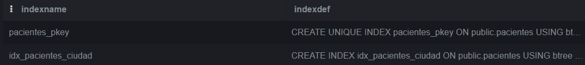

### 2. Se tiene la fecha de nacimiento de los pacientes. Se desea calcular la edad de los pacientes y almacenarla de forma dinámica en el sistema ya que es un valor típicamente consultado, junto con otra información relevante del paciente.

```sql
-- Consigna 2: vista con la edad calculada dinámicamente a partir de la fecha de nacimiento
CREATE VIEW vista_pacientes AS
SELECT
    p.id_paciente,
    p.nombre,
    p.fecha_nacimiento,
    EXTRACT(YEAR FROM AGE(CURRENT_DATE, p.fecha_nacimiento))::INT AS edad,
    s.descripcion AS sexo_biologico,
    p.calle,
    p.numero,
    p.ciudad
FROM pacientes p
JOIN sexobiologico s ON p.id_sexo = s.id_sexo;

SELECT * FROM vista_pacientes ORDER BY id_paciente;
```

La edad es un **atributo derivado**: si se almacenara como columna quedaría desactualizada con el paso del tiempo. Por eso se crea una **vista** (`VIEW`), que no guarda los datos sino la consulta: cada vez que se consulta, la edad se recalcula a partir de `fecha_nacimiento` y la fecha actual (`AGE(CURRENT_DATE, fecha_nacimiento)`). La vista incluye además otros datos relevantes del paciente, como el sexo biológico (obtenido mediante un JOIN con su tabla de referencia) y la dirección.

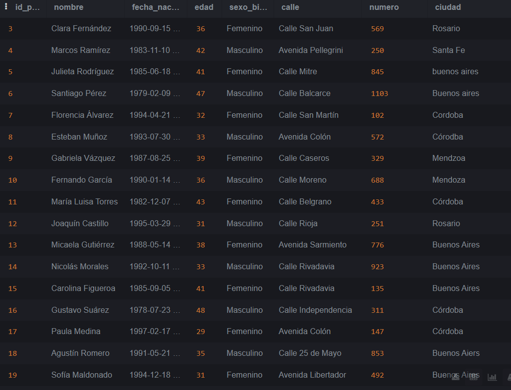

### 3. Obtener nombre y edad de pacientes menores de edad.

```sql
-- Consigna 3: pacientes menores de edad (usa la vista creada en la consigna 2)
SELECT nombre, edad
FROM vista_pacientes
WHERE edad < 18
ORDER BY edad;
```

Se reutiliza la vista de la consigna 2 filtrando las edades menores a 18 años. Al estar la edad calculada respecto de la fecha actual, el resultado depende del día en que se ejecuta la consulta.


### 4. La paciente, “Luciana Gómez”, ha cambiado de dirección. Antes vivía en “Avenida Las Heras 121” en “Buenos Aires”, pero ahora vive en “Calle Corrientes 500” en “Buenos Aires”. Actualizar la dirección de este paciente en la base de datos.

```sql
-- Consigna 4: actualización de la dirección de Luciana Gómez
UPDATE pacientes
SET calle  = 'Calle Corrientes',
    numero = '500',
    ciudad = 'Buenos Aires'
WHERE nombre = 'Luciana Gómez'
  AND calle  = 'Avenida Las Heras'
  AND numero = '121';

SELECT id_paciente, nombre, calle, numero, ciudad
FROM pacientes
WHERE nombre = 'Luciana Gómez';
```

Se actualizan la calle y el número de la paciente. En el `WHERE` se identifica a la paciente por su nombre **y** su dirección anterior, para garantizar que solo se modifique el registro correcto (podría haber más de un paciente con el mismo nombre, como ocurre con "Juan Pérez"). Además, se registra la ciudad como "Buenos Aires", ya que en la base estaba cargada como "Bs Aires".

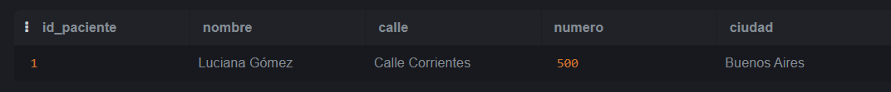

### 5. Obtener el nombre y la dirección de los pacientes que viven en Buenos Aires.

```sql
-- Consigna 5: nombre y dirección de los pacientes que viven en Buenos Aires
SELECT nombre, calle, numero, ciudad
FROM pacientes
WHERE ciudad = 'Buenos Aires'
ORDER BY nombre;
```

Al ejecutar esta consulta antes de la corrección de la consigna 6, el resultado es **incompleto**: solo devuelve los pacientes cuya ciudad está escrita exactamente como "Buenos Aires", omitiendo variantes como "buenos aires", "Buenos   Aires", "Buenos Aiers" o " Buenos Aires" (con espacios). Esta situación evidencia el problema que se resuelve en la consigna 6; una vez aplicada la corrección, la misma consulta devuelve la totalidad de los pacientes de Buenos Aires.

**Resultado antes de la corrección de la consigna 6:**

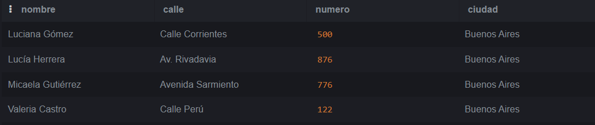

**Resultado después de la corrección de la consigna 6:**

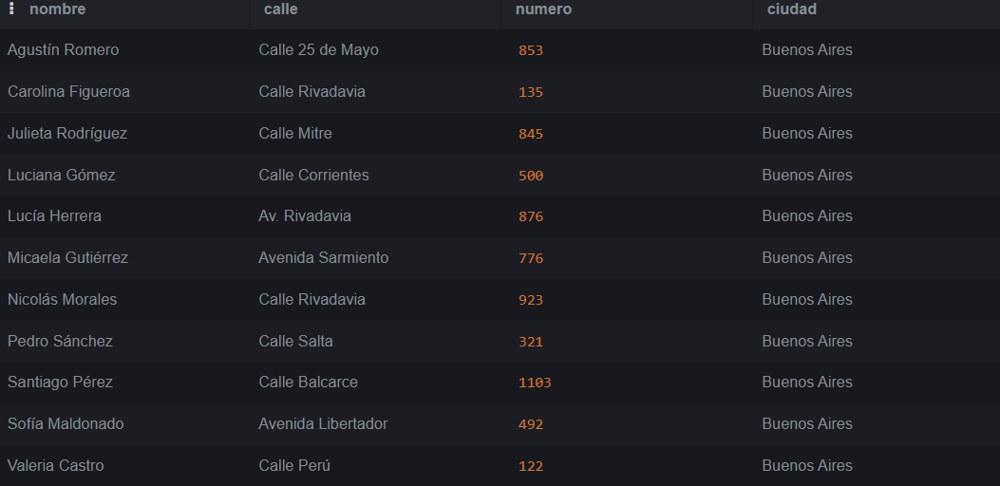

### 6. Puede pasar que haya inconsistencias en la forma en la que están escritos los nombres de las ciudades, ¿cómo se corrige esto? Agregar la query correspondiente.

```sql
-- Consigna 6: corrección de inconsistencias en los nombres de las ciudades
-- Paso 1: se normaliza el texto (espacios sobrantes y mayúsculas/minúsculas)
-- Paso 2: se corrigen abreviaturas y errores de tipeo conocidos
UPDATE pacientes
SET ciudad = CASE LOWER(TRIM(REGEXP_REPLACE(ciudad, '\s+', ' ', 'g')))
                 WHEN 'bs aires'     THEN 'Buenos Aires'
                 WHEN 'buenos aiers' THEN 'Buenos Aires'
                 WHEN 'cordoba'      THEN 'Córdoba'
                 WHEN 'córodba'      THEN 'Córdoba'
                 WHEN 'mendzoa'      THEN 'Mendoza'
                 ELSE INITCAP(TRIM(REGEXP_REPLACE(ciudad, '\s+', ' ', 'g')))
             END;

-- Verificación: cada ciudad debe aparecer escrita de una única forma
SELECT ciudad, COUNT(*) AS cantidad_pacientes
FROM pacientes
GROUP BY ciudad
ORDER BY ciudad;
```

La corrección se realiza con un único `UPDATE` en dos niveles:
1. **Normalización del formato:** `REGEXP_REPLACE` reemplaza espacios múltiples por uno solo, `TRIM` elimina espacios al inicio y al final, y `INITCAP` unifica mayúsculas y minúsculas (primera letra de cada palabra en mayúscula).
2. **Corrección de errores de tipeo y abreviaturas:** mediante `CASE` se reemplazan las variantes detectadas ("Bs Aires", "Buenos Aiers", "Cordoba", "Córodba", "Mendzoa") por el nombre correcto.

Luego se verifica con un `GROUP BY` que cada ciudad aparezca escrita de una única forma. Como solución definitiva, el modelo propuesto en la Parte 1 reemplaza el campo de texto libre por una **tabla de referencia Ciudad**, de modo que cada ciudad se escriba una sola vez y los pacientes la referencien mediante una clave foránea, evitando que estas inconsistencias vuelvan a producirse.

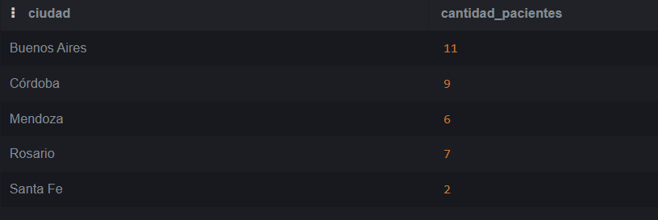

### 7. Cantidad de pacientes por sexo que viven en cada ciudad.

```sql
-- Consigna 7: cantidad de pacientes por sexo en cada ciudad
SELECT p.ciudad,
       s.descripcion AS sexo_biologico,
       COUNT(*) AS cantidad_pacientes
FROM pacientes p
JOIN sexobiologico s ON p.id_sexo = s.id_sexo
GROUP BY p.ciudad, s.descripcion
ORDER BY p.ciudad, s.descripcion;
```

Se agrupa por ciudad y por sexo biológico (obtenido mediante un JOIN con la tabla de referencia `sexobiologico`) y se cuenta la cantidad de pacientes de cada combinación. Se ejecuta después de la consigna 6, para que las ciudades estén unificadas.

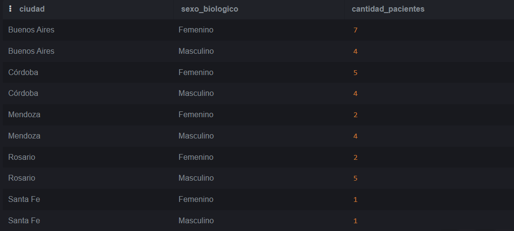

### 8. Obtener todas las consultas médicas realizadas por el médico con ID igual a 3 durante el mes de agosto de 2024.

```sql
-- Consigna 8: consultas del médico con ID 3 durante agosto de 2024
SELECT *
FROM consultas
WHERE id_medico = 3
  AND fecha >= '2024-08-01'
  AND fecha <  '2024-09-01'
ORDER BY fecha;
```

Se filtran las consultas del médico 3 cuya fecha está dentro de agosto de 2024. Se utiliza un rango de fechas (`>= 2024-08-01` y `< 2024-09-01`) en lugar de extraer el mes y el año, ya que incluye todos los días del mes sin depender de cuántos tenga y permite al motor aprovechar índices sobre la columna fecha.

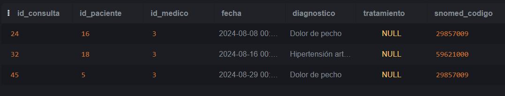

### 9. Obtener la cantidad de recetas emitidas por cada médico.

```sql
-- Consigna 9: cantidad de recetas emitidas por cada médico
SELECT m.id_medico,
       m.nombre,
       COUNT(r.id_receta) AS cantidad_recetas
FROM medicos m
LEFT JOIN recetas r ON m.id_medico = r.id_medico
GROUP BY m.id_medico, m.nombre
ORDER BY cantidad_recetas DESC, m.nombre;
```

Se utiliza un `LEFT JOIN` entre médicos y recetas para incluir también a los médicos que no emitieron ninguna receta (con cantidad 0); con un `JOIN` común esos médicos no aparecerían. Se cuenta `id_receta` (y no `*`) para que los médicos sin recetas den 0 y no 1. Se agrupa por `id_medico` además del nombre, para no unificar médicos distintos con el mismo nombre.

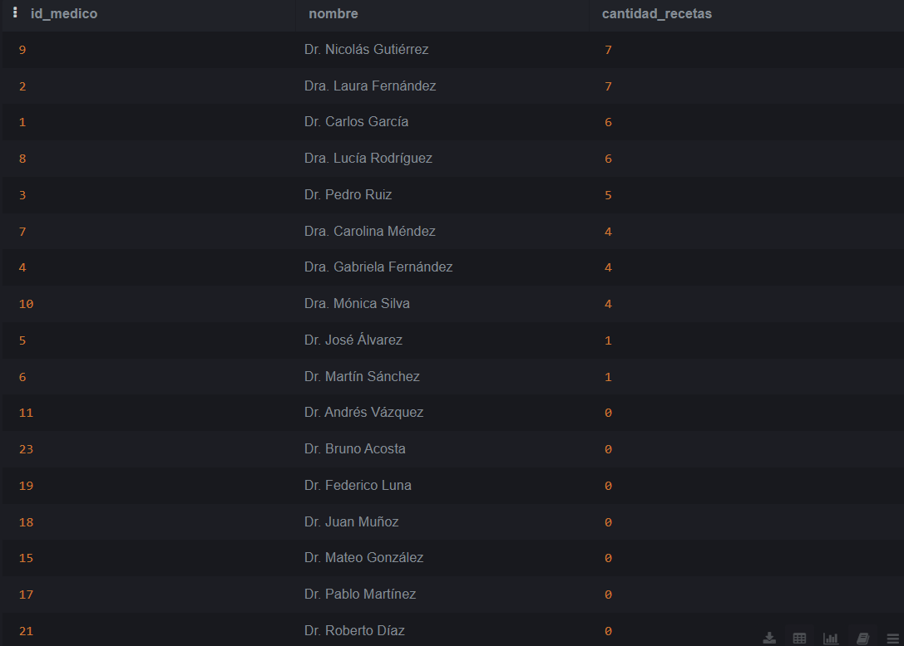


### 10. Obtener el nombre de los pacientes junto con la fecha y el diagnóstico de todas las consultas médicas realizadas en agosto del 2024.

```sql
-- Consigna 10: pacientes con fecha y diagnóstico de las consultas de agosto de 2024
SELECT p.nombre,
       c.fecha,
       c.diagnostico
FROM consultas c
JOIN pacientes p ON c.id_paciente = p.id_paciente
WHERE c.fecha >= '2024-08-01'
  AND c.fecha <  '2024-09-01'
ORDER BY c.fecha, p.nombre;
```

Se combinan las tablas de consultas y pacientes mediante un JOIN por `id_paciente` para obtener el nombre del paciente, y se filtran las consultas de agosto de 2024 con el mismo rango de fechas de la consigna 8.

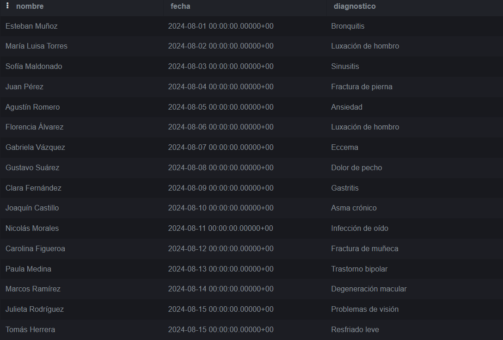
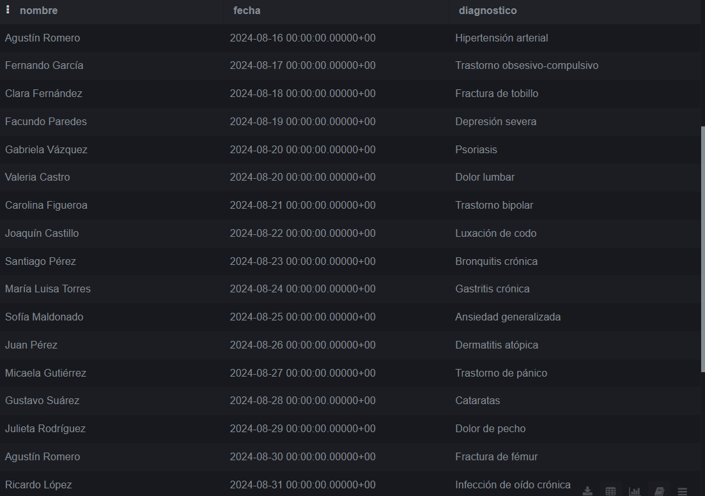

### 11. Obtener el nombre de los medicamentos prescritos más de una vez por el médico con ID igual a 2.

```sql
-- Consigna 11: medicamentos prescritos más de una vez por el médico con ID 2
SELECT m.nombre AS medicamento,
       COUNT(*) AS veces_prescrito
FROM recetas r
JOIN medicamentos m ON r.id_medicamento = m.id_medicamento
WHERE r.id_medico = 2
GROUP BY m.id_medicamento, m.nombre
HAVING COUNT(*) > 1
ORDER BY veces_prescrito DESC;
```

Se filtran las recetas del médico 2, se agrupan por medicamento y se cuenta cuántas veces fue prescrito cada uno. La condición "más de una vez" se aplica con `HAVING` y no con `WHERE`: `WHERE` filtra filas individuales antes de agrupar, mientras que `HAVING` filtra los grupos ya formados, y es el único que puede evaluar el resultado de una función de agregación como `COUNT(*)`.


### 12. Obtener el nombre de cada paciente junto con la cantidad total de recetas que ha recibido.

```sql
-- Consigna 12: cantidad total de recetas recibidas por cada paciente
SELECT p.id_paciente,
       p.nombre,
       COUNT(r.id_receta) AS cantidad_recetas
FROM pacientes p
LEFT JOIN recetas r ON p.id_paciente = r.id_paciente
GROUP BY p.id_paciente, p.nombre
ORDER BY cantidad_recetas DESC, p.nombre;
```

Se utiliza un `LEFT JOIN` desde pacientes hacia recetas para incluir también a los pacientes que no recibieron ninguna receta (que aparecen con 0). Se agrupa por `id_paciente` y no solo por nombre porque existen dos pacientes distintos llamados "Juan Pérez": si se agrupara únicamente por nombre, sus recetas se sumarían como si fueran de una misma persona. Por ese motivo también se muestra el `id_paciente`, que permite distinguirlos.

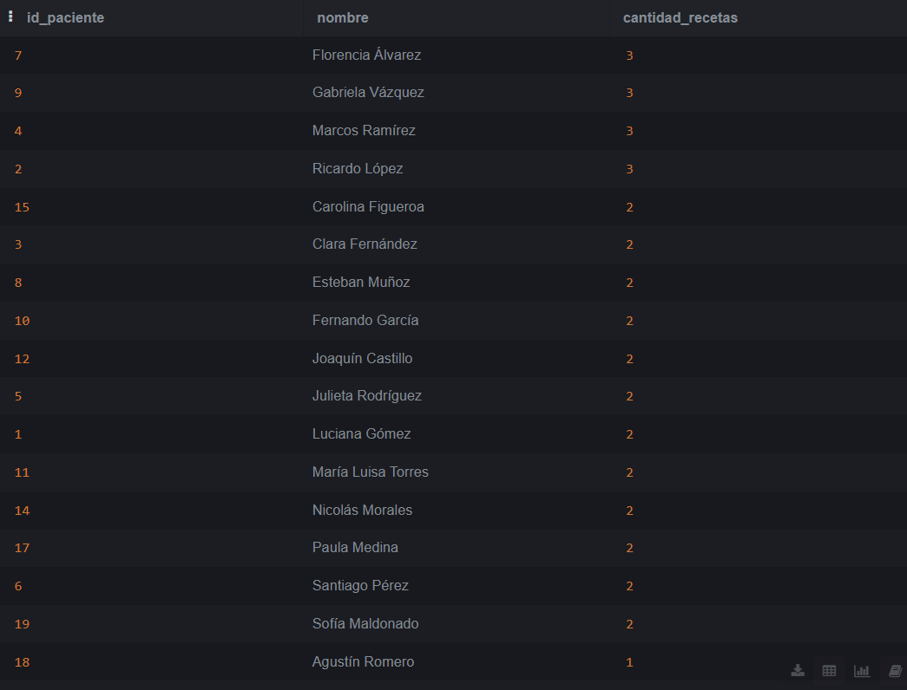
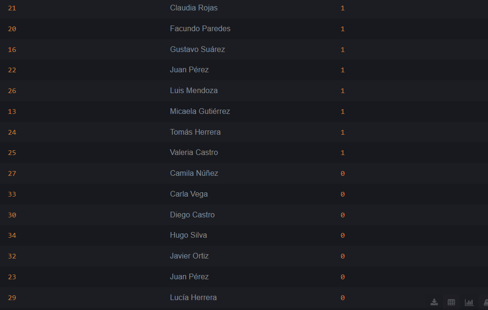
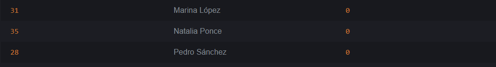

### 13. Obtener el nombre de cada especialidad y la cantidad de médicos que pertenecen a ella, mostrando únicamente aquellas especialidades que tienen más de 2 médicos.

```sql
-- Consigna 13: especialidades con más de 2 médicos
SELECT e.nombre AS especialidad,
       COUNT(m.id_medico) AS cantidad_medicos
FROM especialidades e
JOIN medicos m ON m.especialidad_id = e.id_especialidad
GROUP BY e.id_especialidad, e.nombre
HAVING COUNT(m.id_medico) > 2
ORDER BY cantidad_medicos DESC, e.nombre;
```

Se vinculan especialidades y médicos, se agrupa por especialidad y se cuentan los médicos de cada una. El filtro "más de 2 médicos" se aplica con `HAVING`, ya que se evalúa sobre el resultado del conteo de cada grupo. Los médicos sin especialidad asignada (con `especialidad_id` en NULL) no se cuentan en ninguna especialidad.

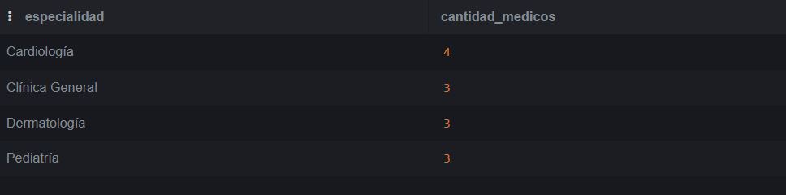

### 14. Obtener el nombre y la edad de los pacientes cuya edad sea mayor al promedio de edad de todos los pacientes, ordenados de mayor a menor edad.

```sql
-- Consigna 14: pacientes con edad mayor al promedio de edad de todos los pacientes (usa la vista de la consigna 2)
SELECT nombre, edad
FROM vista_pacientes
WHERE edad > (SELECT AVG(edad) FROM vista_pacientes)
ORDER BY edad DESC;
```

Se utiliza una **subconsulta** que calcula el promedio de edad de todos los pacientes (`AVG(edad)`) y se compara la edad de cada paciente contra ese valor. Se reutiliza la vista de la consigna 2, por lo que la edad y el promedio se calculan siempre respecto de la fecha actual: el resultado puede variar según el día en que se ejecute la consulta.

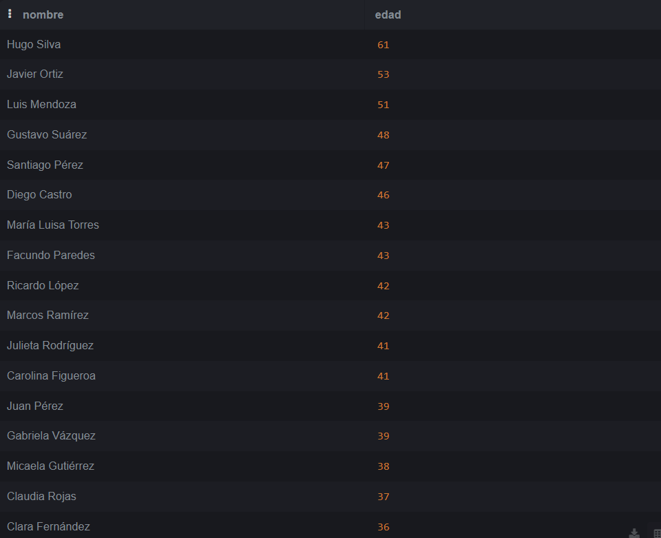


### 15. Obtener los medicamentos que ocupan las dos primeras posiciones en cantidad de recetas emitidas, indicando para cada uno la cantidad de recetas.

```sql
-- Consigna 15: medicamentos que ocupan las dos primeras posiciones en cantidad de recetas
-- Se contemplan empates: se devuelven todos los medicamentos cuya cantidad de recetas
-- coincide con alguno de los dos valores más altos.
WITH recetas_por_medicamento AS (
    SELECT m.nombre AS medicamento,
           COUNT(r.id_receta) AS cantidad_recetas
    FROM medicamentos m
    JOIN recetas r ON r.id_medicamento = m.id_medicamento
    GROUP BY m.id_medicamento, m.nombre
)
SELECT medicamento, cantidad_recetas
FROM recetas_por_medicamento
WHERE cantidad_recetas IN (
    SELECT DISTINCT cantidad_recetas
    FROM recetas_por_medicamento
    ORDER BY cantidad_recetas DESC
    LIMIT 2
)
ORDER BY cantidad_recetas DESC, medicamento;
```

Primero se calcula, con una expresión `WITH`, la cantidad de recetas de cada medicamento. Luego una subconsulta obtiene los dos valores de cantidad más altos (`DISTINCT ... ORDER BY ... DESC LIMIT 2`) y se devuelven todos los medicamentos cuya cantidad coincide con alguno de ellos. Se eligió esta solución en lugar de un simple `ORDER BY ... LIMIT 2` porque existen **empates**: un medicamento ocupa la primera posición y varios comparten la segunda con la misma cantidad de recetas. Con `LIMIT 2` se mostraría solo uno de los empatados en segundo lugar, elegido de forma arbitraria por el motor, y se omitirían los demás.

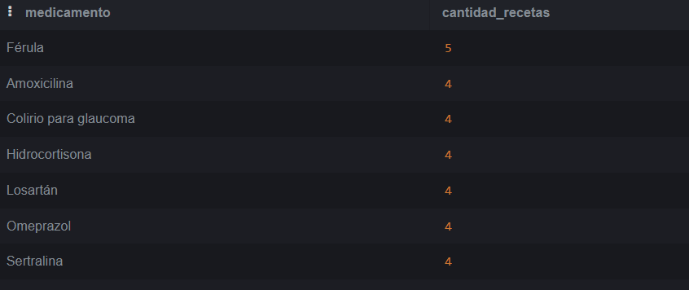

### 16. Obtener el nombre del paciente junto con la fecha de su última consulta y el diagnóstico asociado.

```sql
-- Consigna 16: nombre del paciente con la fecha de su última consulta y el diagnóstico asociado
WITH ultima_consulta AS (
    SELECT id_paciente,
           MAX(fecha) AS fecha_ultima
    FROM consultas
    GROUP BY id_paciente
)
SELECT p.nombre,
       c.fecha AS fecha_ultima_consulta,
       c.diagnostico
FROM ultima_consulta u
JOIN consultas c ON c.id_paciente = u.id_paciente
                AND c.fecha = u.fecha_ultima
JOIN pacientes p ON p.id_paciente = u.id_paciente
ORDER BY c.fecha DESC, p.nombre;
```

La consulta se resuelve en dos pasos. Primero, la expresión `WITH ultima_consulta` obtiene para cada paciente la fecha de su consulta más reciente (`MAX(fecha)` agrupado por paciente). Luego se vuelve a unir con la tabla de consultas usando el paciente **y** esa fecha, para recuperar el diagnóstico de esa consulta puntual. No alcanza con agregar `diagnostico` al `GROUP BY` junto con `MAX(fecha)`, ya que eso devolvería la última fecha de cada combinación paciente-diagnóstico, y no el diagnóstico de la última consulta. Se verificó que ningún paciente tiene dos consultas en la misma fecha, por lo que cada paciente aparece una única vez. Solo se listan los 25 pacientes que tienen al menos una consulta registrada.

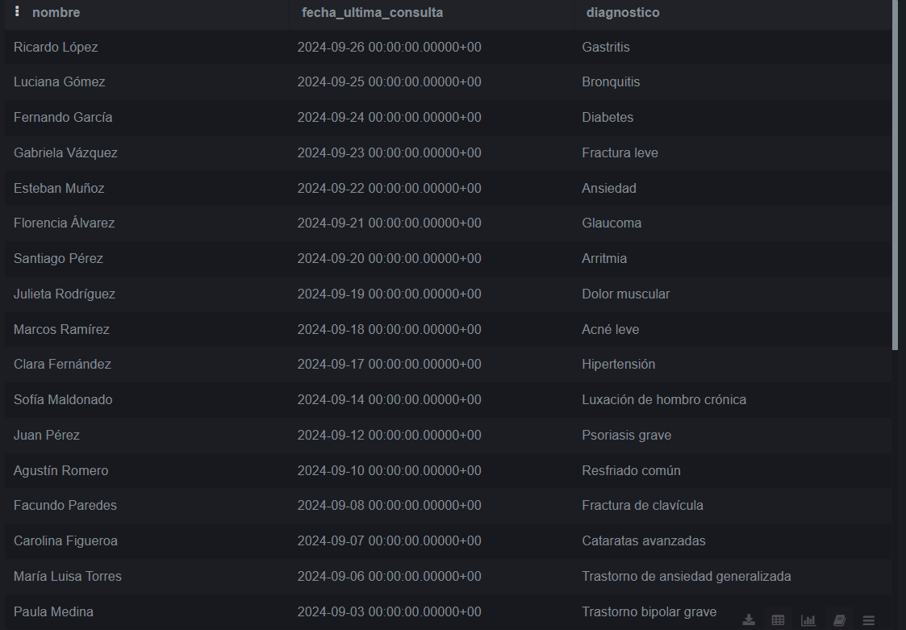
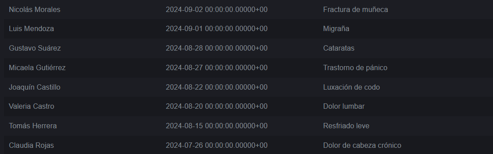

### 17. Obtener el nombre del médico junto con el nombre del paciente y el número total de consultas realizadas por cada médico para cada paciente, ordenado por médico y paciente.

```sql
-- Consigna 17: total de consultas de cada médico con cada paciente
SELECT m.nombre AS medico,
       p.nombre AS paciente,
       COUNT(c.id_consulta) AS total_consultas
FROM consultas c
JOIN medicos m   ON c.id_medico = m.id_medico
JOIN pacientes p ON c.id_paciente = p.id_paciente
GROUP BY m.id_medico, m.nombre, p.id_paciente, p.nombre
ORDER BY m.nombre, p.nombre;
```

Se agrupa por médico y por paciente y se cuentan las consultas de cada combinación. Se agrupa por los identificadores (`id_medico`, `id_paciente`) además de los nombres, para no unificar personas distintas con el mismo nombre (como los dos pacientes "Juan Pérez"). El resultado se ordena alfabéticamente por médico y, dentro de cada médico, por paciente.

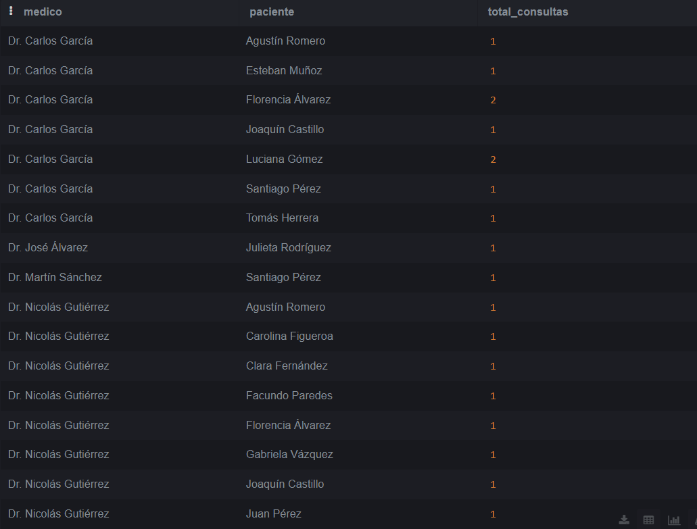
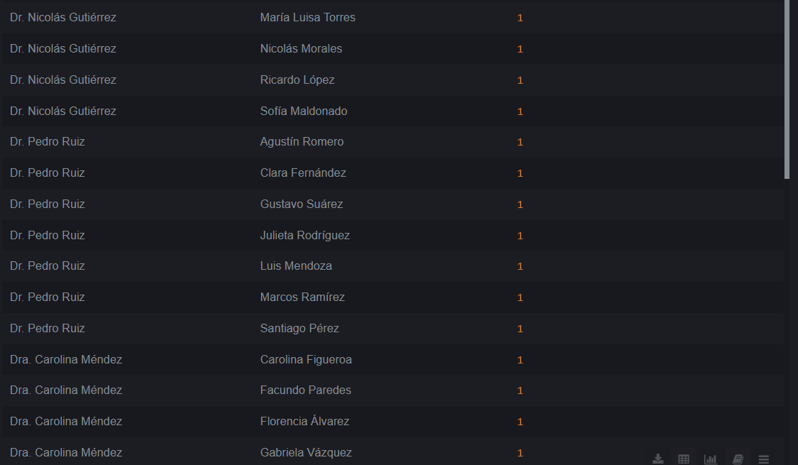
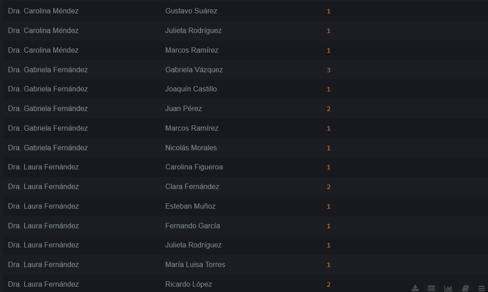
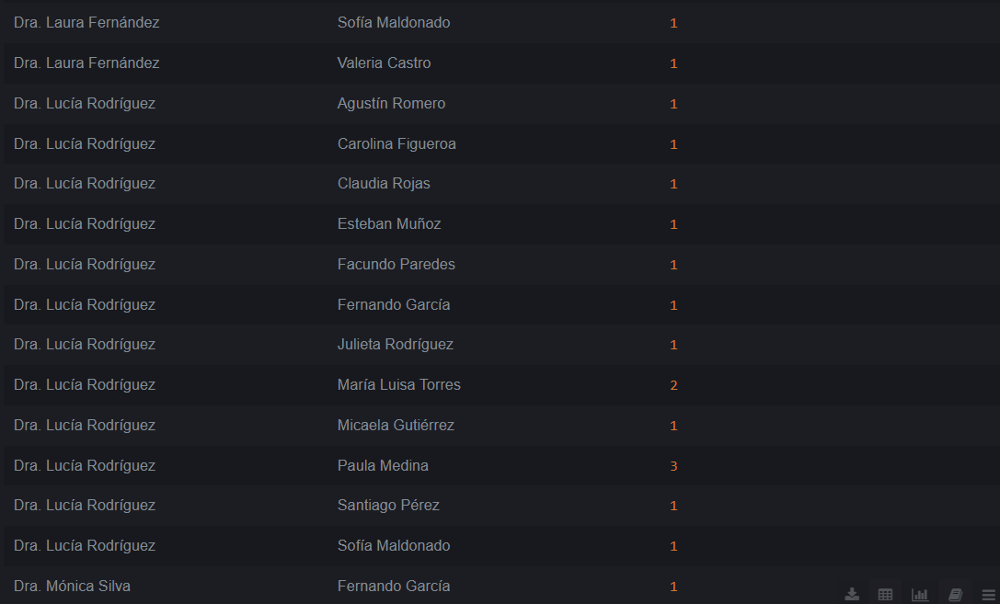
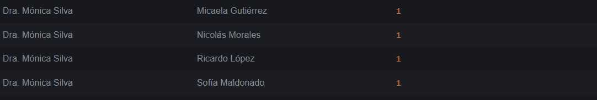

### 18. Obtener el nombre del medicamento junto con el total de recetas prescritas para ese medicamento, el nombre del médico que lo recetó y el nombre del paciente al que se le recetó, ordenado por total de recetas en orden descendente.

```sql
-- Consigna 18: medicamento con su total de recetas, junto con el médico que lo recetó y el paciente
WITH total_por_medicamento AS (
    SELECT id_medicamento,
           COUNT(*) AS total_recetas
    FROM recetas
    GROUP BY id_medicamento
)
SELECT med.nombre AS medicamento,
       t.total_recetas,
       m.nombre AS medico,
       p.nombre AS paciente
FROM recetas r
JOIN total_por_medicamento t ON r.id_medicamento = t.id_medicamento
JOIN medicamentos med        ON r.id_medicamento = med.id_medicamento
JOIN medicos m               ON r.id_medico = m.id_medico
JOIN pacientes p             ON r.id_paciente = p.id_paciente
ORDER BY t.total_recetas DESC, med.nombre, m.nombre, p.nombre;
```

La consigna combina dos niveles de información: un **total por medicamento** y el **detalle de cada receta** (médico y paciente). Por eso primero se calcula, con `WITH total_por_medicamento`, la cantidad de recetas de cada medicamento, y luego se une ese total con cada receta para mostrar el médico que la emitió y el paciente que la recibió. Así, cada fila corresponde a una receta y muestra el total de su medicamento, lo que permite ordenar por ese total en forma descendente. Si en cambio se agrupara por medicamento, médico y paciente, el conteo representaría las recetas de cada combinación y no el total de recetas del medicamento que pide la consigna.

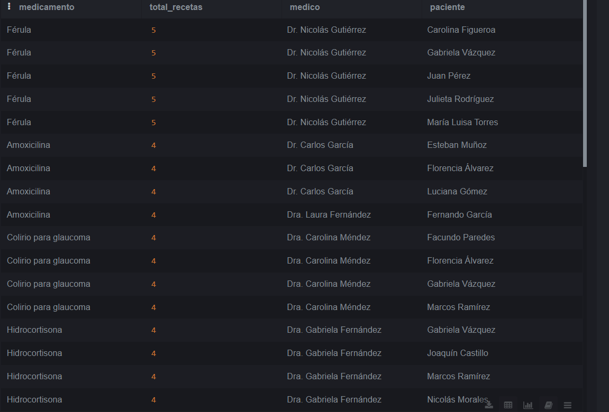
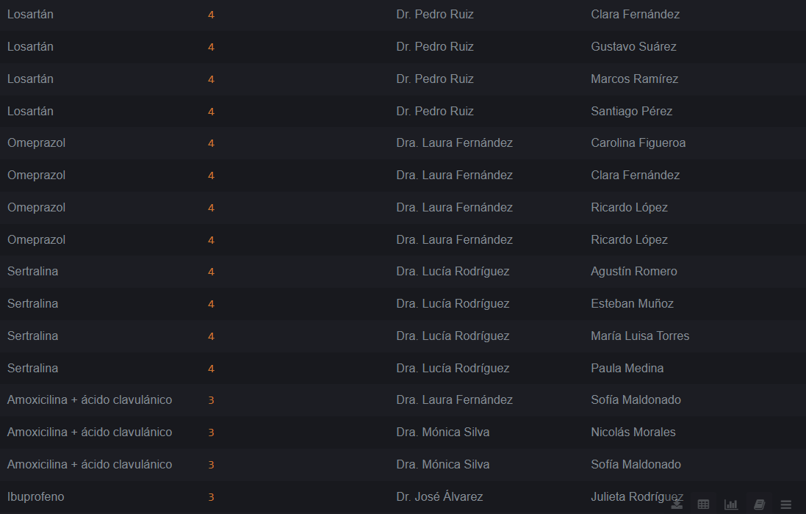
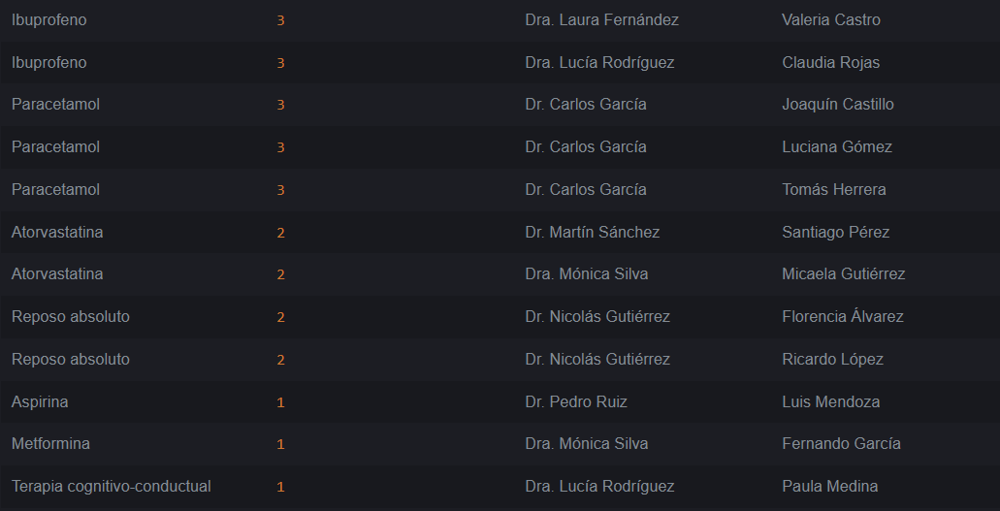

### 19. Obtener el nombre del médico junto con el total de pacientes a los que ha atendido, ordenado por el total de pacientes en orden descendente.

```sql
-- Consigna 19: total de pacientes distintos atendidos por cada médico
SELECT m.nombre AS medico,
       COUNT(DISTINCT c.id_paciente) AS total_pacientes
FROM medicos m
LEFT JOIN consultas c ON c.id_medico = m.id_medico
GROUP BY m.id_medico, m.nombre
ORDER BY total_pacientes DESC, m.nombre;
```

Se cuentan los pacientes **distintos** atendidos por cada médico con `COUNT(DISTINCT c.id_paciente)`: si un paciente fue atendido varias veces por el mismo médico, se cuenta una sola vez, ya que la consigna pide la cantidad de pacientes y no de consultas. Se usa `LEFT JOIN` para incluir a los médicos sin consultas registradas, que aparecen con 0.

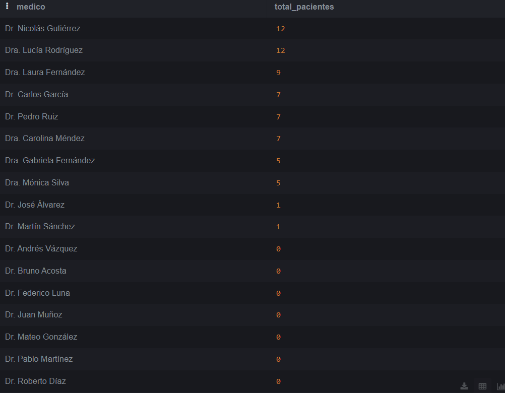
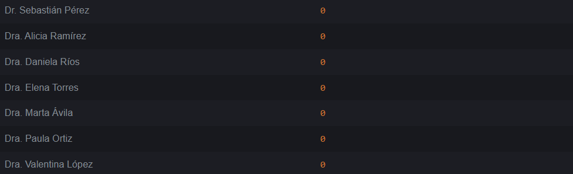

### 20. Obtener el nombre de cada médico junto con el número total de consultas realizadas por cada uno a pacientes menores de edad y una tercera columna que indique si el médico es pediatra (TRUE/FALSE).

```sql
-- Consigna 20: consultas de cada médico a pacientes menores de edad e indicación de si es pediatra
-- Usa la vista de la consigna 2 para obtener la edad de los pacientes
SELECT m.nombre AS medico,
       COUNT(v.id_paciente) AS consultas_menores,
       CASE WHEN e.nombre = 'Pediatría' THEN TRUE ELSE FALSE END AS es_pediatra
FROM medicos m
LEFT JOIN especialidades e  ON m.especialidad_id = e.id_especialidad
LEFT JOIN consultas c       ON c.id_medico = m.id_medico
LEFT JOIN vista_pacientes v ON v.id_paciente = c.id_paciente
                           AND v.edad < 18
GROUP BY m.id_medico, m.nombre, e.nombre
ORDER BY consultas_menores DESC, m.nombre;
```

Se parte de la tabla de médicos y se usan `LEFT JOIN` en todas las uniones para que aparezcan todos los médicos, incluidos los que no atendieron menores (con 0) y los que no tienen especialidad asignada. La condición `v.edad < 18` se ubica dentro del `ON` del JOIN con la vista de la consigna 2 y no en el `WHERE`: de esta forma solo se emparejan las consultas a menores, y `COUNT(v.id_paciente)` cuenta únicamente esas, sin eliminar del resultado a los médicos que no tienen ninguna. Si la condición estuviera en el `WHERE`, esos médicos desaparecerían. La tercera columna se obtiene con `CASE`, que devuelve TRUE si la especialidad del médico es Pediatría y FALSE en cualquier otro caso, incluidos los médicos sin especialidad (cuyo valor es NULL).

*Observación:* la edad se calcula respecto de la fecha actual, de manera coherente con la consigna 3. Se verificó que en este conjunto de datos el resultado es el mismo si se considera la edad del paciente al momento de la consulta: la única consulta a un paciente menor corresponde a Valeria Castro, atendida por una pediatra.

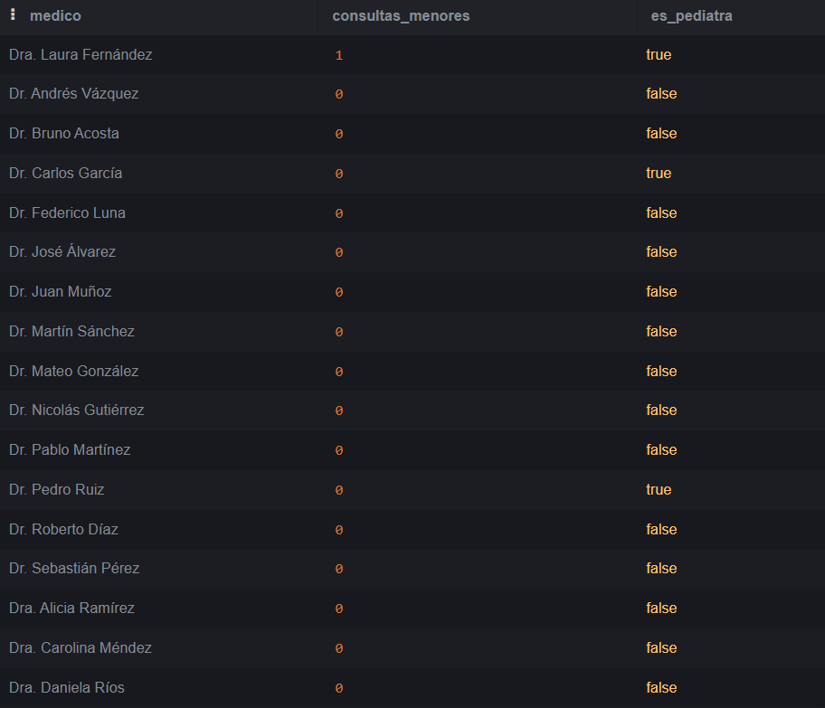
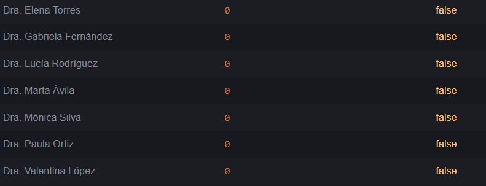

